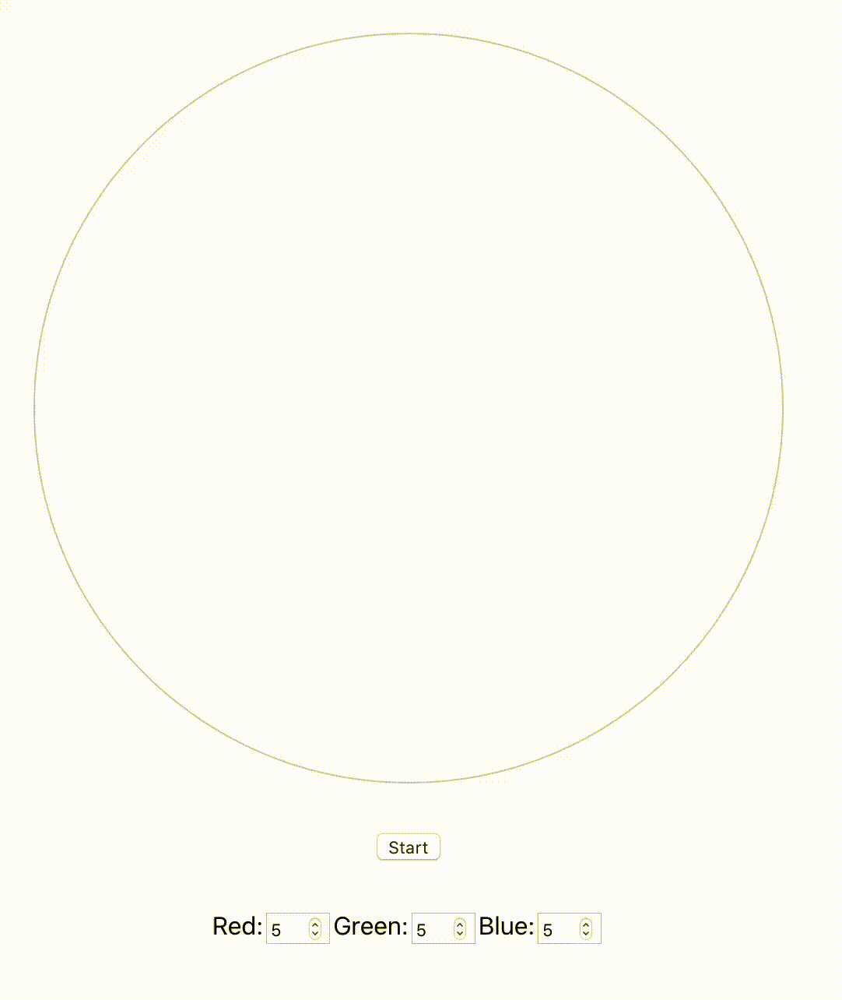

## [1 Day 1 Project](https://github.com/bugxvii/OneDay_OneProject) 

Day 5: Color Cycle

## Description
Cycle a color value through incremental changes.

This project idea is originally from [here](https://github.com/florinpop17/app-ideas).

## SPEC
- HTML 5
- CSS
- TypeScript
- React
  + [Create React App](https://github.com/facebook/create-react-app)

## Reference
- TypeScript basic tutorial by [Ben Awad](https://youtu.be/Z5iWr6Srsj8)
